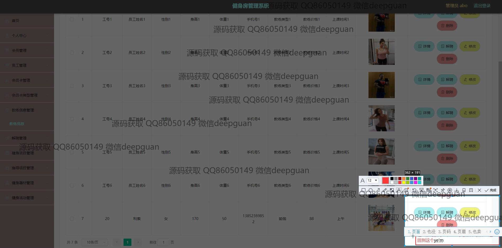
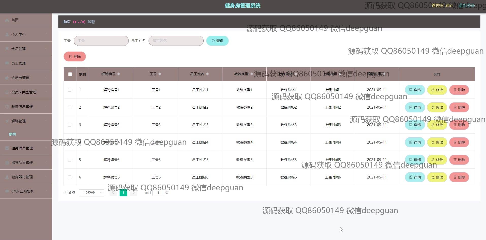

<h1 align="center">健身房管理系统</h1>

## 简介
健身房管理系统：角色分为管理员、用户；功能包括会员管理、员工管理、课程安排、教练信息、健身项目管理、会员卡管理、信息查询与录入。系统旨在提高运营效率，优化用户体验。    --计算机毕业设计源码；毕设源码；java毕业设计源码

## 联系方式

<h3 align="center">获取完整代码与数据库文件 + 微信：deepguan QQ: 86050149 QQ群: 783742310</h3>

<h3 align="center">可帮忙远程部署 包运行成功！提供远程部署、修改代码、设计文档指导、代码讲解等服务！</h3>

## 功能介绍（完整见运行截图）
管理员：基于Spring Boot的健身房管理系统提供了用户登录和注册功能，以及退出选项。系统包含个人中心的访问权限，方便管理员查看和修改个人信息。管理员可以管理会员信息、员工信息、会员卡类型、教练资料、课程安排和健身项目等功能模块。通过该系统，管理员可以执行添加、修改、删除和查询操作，以便于日常健身房运营管理。此外，管理员还拥有对会员卡申请的审核权限，以及管理健身器材信息和优化健身房运营通过统计分析功能。

会员：登录和注册功能允许会员以个人身份访问系统，并能退出登录。会员可以通过个人中心查看和修改个人信息，查询购买的会员卡和课程信息。系统提供查询、增加和删除会员功能，会员能够通过查看各类健身项目、课程安排和教练信息，进行相关预约和支付操作。健身项目管理部分允许会员获取项目的详细概况，包括项目类型和指导教练，以制定个人健身计划。

教练：教练通过系统可以查看和管理个人资料以及教授的课程安排。系统为教练提供个人信息输入和修改功能，并显示他们的课程时间表。教练信息管理模块允许教练监管课程报名情况，更新课程类型、价格及时间表。此外，教练还可利用平台展示和推销个人健身课程，吸引会员参与课程活动。

员工：系统允许员工通过注册界面录入个人信息，如工号、电话和邮箱，进行信息管理。员工能够访问个人中心并管理个人基本信息，查看负责的会员、教练和项目，通过系统接收相关管理任务指派。员工有权限管理健身房日常运营相关模块，如会员卡管理、课程安排及健身项目，以确保健身房运营的顺畅进行。

## 运行截图

本代码来源于网络,仅供学习参考使用!

